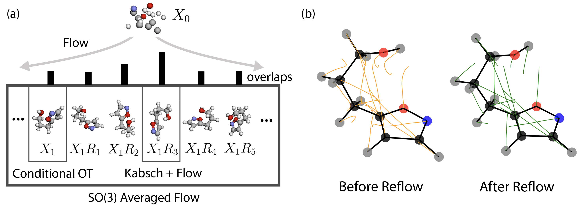

<h1 align="center"> Efficient Molecular Conformer Generation with SO(3) <em>Averaged Flow</em>-Matching and Reflow</h1>


This is the official code repository for the paper titled [Efficient Molecular Conformer Generation with SO(3) Averaged Flow-Matching and Reflow](https://arxiv.org/abs/2507.09785) (ICML 2025).

<p align="center">
    
</p>

## Contribution
+ We propose SO(3)-*Averaged Flow*: A novel flow-matching objective that analytically computes the probability flow from noise to all rotations of the data. When the "correctness" of samples is rotational invariant (such as conformer generation), SO(3)-*Averaged Flow* improves training efficiency by eliminating the need for rotational data augmentation and further improves model performance.
+ We propose to use reflow+distillation to reduce the number of sampling steps of flow-based model for conformer generation and maintain high generation quality.
+ We provide a JAX implementation of the diffusion transformer with pairwise biased attention architecture. It is powerful and scalable for generative modeling of molecules. 
## Installation
Clone this repository:
```bash
git clone https://github.com/NVIDIA-Digital-Bio/avgflow.git
cd avgflow
```

Run the following command to create a conda environment and install the dependencies:
```bash
conda env create -f env.yml
conda activate avgflow
```

## Pretrained Checkpoints
We provide 3 model weights through the NVIDIA NGC, including: 
1. 52M DiT trained with AvgFlow objective ([Link](https://catalog.ngc.nvidia.com/orgs/nvidia/teams/clara/resources/avgflow_52m_ckpt?version=avgflow_52m_ckpt))
1. 52M DiT finetuned with reflow for few-step generation ([Link](https://catalog.ngc.nvidia.com/orgs/nvidia/teams/clara/resources/avgflow_52m_reflow_ckpt?version=avgflow_52m_reflow_ckpt))
1. 52M DiT finetuned with reflow+distillation for 1-step generation ([Link](https://catalog.ngc.nvidia.com/orgs/nvidia/teams/clara/resources/avgflow_52m_distill_ckpt?version=avgflow_52m_distill_ckpt))
1. 64M DiT trained with AvgFlow objective. ([Link](https://catalog.ngc.nvidia.com/orgs/nvidia/teams/clara/resources/avgflow_64m_ckpt?version=avgflow_64m_ckpt))

If you have [NGC CLI tool](https://docs.ngc.nvidia.com/cli/cmd.html) installed, you can run the following command to download the checkpoints:
```bash
bash scripts/download_ckpts.sh
```

Otherwise, you can create a checkpoints directory by:
```bash
mkdir -p checkpoints
```
and download the checkpoints from the NGC pages above. 

## Sampling
The model can be used to generate conformers given: 1. a single SMILES string, or 2. a CSV file containing a batch of SMILES strings and the number of conformers to be generated for each molecule. 

For conformer generation of a single molecule, run:
```
python avgflow/generate_from_smiles.py \
    --config PATH/TO/CONFIG.yaml \
    --smiles SMILES_STRING \
    --num_confs N_CONF \
    --output_dir PATH/TO/OUTPUT/DIRECTORY \
```
Example can be found in `example/sampling/gen_smiles.sh`, which generates 40 conformers for molecule `C#CCNC(=O)C1=C[C@@H](c2ccc(Br)cc2)C[C@@H](OCc2ccc(CO)cc2)O1`.

For conformer generation of a batch of molecules in a csv file, run:
```
python avgflow/generate_from_csv.py \
    --config PATH/TO/CONFIG.yaml \
    --smiles_csv PATH/TO/SMILES.csv \
    --output_dir PATH/TO/OUTPUT/DIRECTORY \
```
Example can be found in `example/sampling/gen_csv.sh`, which generate various number of conformers for molecules in `example/data/toy_gen_csv.csv`. Please follow the format of `example/data/toy_gen_csv.csv` to construct your own csv for sampling. 

The config yaml files define the model architecture to be initialized and checkpoint to be loaded. We provide 4 config files for the 4 checkpoints we released:
1. `config/generation_config/avgflow_52m_gen.yaml` for the 52M DiT trained with AvgFlow objective.
2. `config/generation_config/avgflow_64m_gen.yaml` for the 64M DiT trained with AvgFlow objective.
3. `config/generation_config/avgflow_52m_reflow_gen.yaml` for the 52M DiT finetuned with reflow for few-step generation.
4. `config/generation_config/avgflow_52m_distill_gen.yaml` for the 52M DiT finetuned with reflow+distillation for 1-step generation.

Please choose the config based on your checkpoint choice, and note that the distilled checkpoint **only** works with 1-step generation.

## Training
### Preparation of training data
Each molecule with ground truth conformers in the dataset has to be preprocessed before training. We recommend to have a dictionary for each molecule that contains at least 2 keys: 
1. `features`: Features computed from the 2D molecular graph using `data_preprocessing.preprocess.mol2features`
1. `conformers`: np.array with dimension `[C, N, 3]`, where `C` is the number of conformers and `N` is the number of atoms in the molecule. 

For reflow/distill finetuning which requires ($X'_0$, $X'_1$) pairs, we recommend the preprocessed dictionary to contain 2 other keys instead of `conformer`:
1. `x0s`: np.array with dimension `[C, N, 3]`, where `C` is the number of ($X'_0$, $X'_1$) pairs and `N` is the number of atoms in the molecule. Gaussian noise at $t=0$.
1. `x1s`: np.array with dimension `[C, N, 3]`, where `C` is the number of ($X'_0$, $X'_1$) pairs and `N` is the number of atoms in the molecule. Model generated conformer at $t=1$ from each corresponding `x0s`. 

Please refer to `example/data/generate_toy_dataset.ipynb` for example of creating the toy training and finetuning datasets.

### Launch training
Follow the following steps to launch training:
1. Prepare dataset as illustrated above.
1. Prepare training config. See example in `config/train_config/avgflow_52m_train_toy.yaml`. 
1. (Optional) Change how the preprocessed dataset is loaded in `avgflow/train.py` line 45-58. You may parallelize the data loading for large training dataset.
1. Launch training (see example in `example/train/train_toy.sh`) with:
```
python avgflow/train.py --config PATH/TO/CONFIG.yaml 
``` 

Follow the same procedure and use `avgflow/reflow_finetune.py` for finetuning.

## License
Copyright @ 2025, NVIDIA Corporation. All rights reserved.<br>
The source code is made available under Apache-2.0.<br>
The model weights are made available under the [NVIDIA Open Model License](https://www.nvidia.com/en-us/agreements/enterprise-software/nvidia-open-model-license/).
## Citation
If you find this repository and our paper useful, please cite our work through:
```BibTex
@article{cao2025efficient,
  title   = {Efficient Molecular Conformer Generation with SO (3)-Averaged Flow Matching and Reflow},
  author  = {Cao, Zhonglin and Geiger, Mario and Costa, Allan Dos Santos and Reidenbach, Danny and Kreis, Karsten and Geffner, Tomas and Pellegrini, Franco and Zhou, Guoqing and Kucukbenli, Emine},
  journal = {arXiv preprint arXiv:2507.09785},
  year    = {2025}
}
```
## Disclaimer
This project will download and install additional third-party open source software projects. Review the license terms of these open source projects before use.
